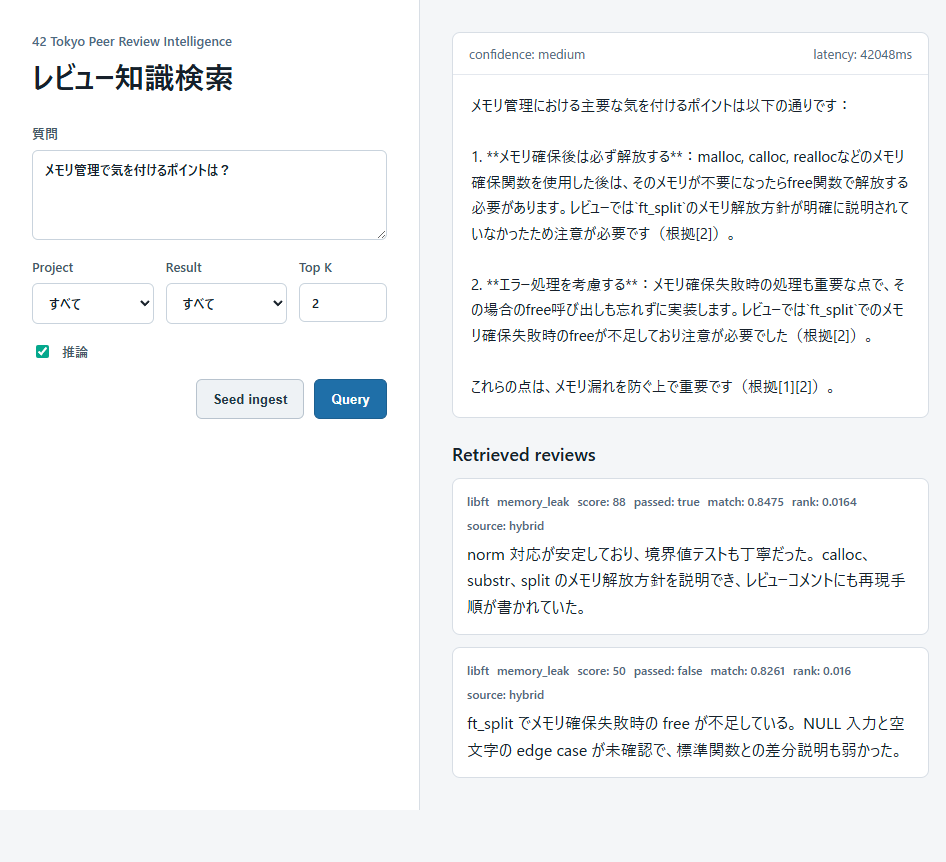

# ReviewRAG

Japanese-first RAG MVP for turning anonymized 42 Tokyo peer review feedback into searchable engineering knowledge.

## Demo



The demo UI lets users ask Japanese review questions, apply project/result filters,
toggle Ollama generation, and inspect the retrieved review snippets that ground
the answer.

## Stack

- FastAPI backend
- PostgreSQL + pgvector
- Ollama local generation, default model `qwen2.5:7b-instruct`
- Semantic embeddings with `sentence-transformers` and `intfloat/multilingual-e5-small`
- Hybrid retrieval with BM25-style keyword search + vector search
- Deterministic embedding backend for local smoke tests

## Architecture

ReviewRAG is a local-first RAG pipeline that turns anonymized 42 Tokyo peer
review comments into searchable engineering knowledge. The system is organized
around five layers: ingestion, indexing, retrieval, generation, and API/UI.

```text
reviews.json
  -> normalization
  -> chunking
  -> keyword term extraction
  -> embedding generation
  -> PostgreSQL + pgvector
  -> vector / keyword / hybrid retrieval
  -> optional reranking
  -> Ollama answer generation
  -> FastAPI response / browser UI
```

The ingestion layer loads JSON or JSONL review records, normalizes metadata,
chunks review text, extracts keyword-search terms, generates embeddings, and
stores the result in PostgreSQL. The database keeps both structured review
metadata and vector embeddings, so retrieval can combine semantic similarity
with filters such as project, campus, language, topic, and pass/fail result.

The retrieval layer supports `vector`, `keyword`, and `hybrid` modes. Hybrid
retrieval combines vector similarity with BM25-style keyword search using
reciprocal rank fusion, with optional reranking for higher-quality ordering.
The generation layer sends retrieved evidence to Ollama and asks a local LLM to
produce a grounded Japanese answer. If generation is unavailable, the app falls
back to an evidence-based retrieval summary.

FastAPI exposes the pipeline through health, ingestion, retrieval, query,
streaming query, evaluation, and metrics endpoints. The browser UI provides a
small query widget with filters, retrieved review snippets, confidence, latency,
and an inference toggle for retrieval-only searches.

## Quick Start

```bash
cp .env.example .env
make ingest
```

Open `http://localhost:8000`, then ask a Japanese review question.

`make ingest` is the first-time setup path: it builds the app image, starts the
services, and ingests the seed data with fresh embeddings. Later, use:

```bash
make run
```

`make run` starts the existing containers/images without `--build`, so it does
not reinstall Python dependencies on every startup. Use `make rebuild` only
after dependency or image changes.

The Makefile uses the development Compose override by default so downloaded
`sentence-transformers` models stay in the `reviewrag_huggingface_cache` Docker
volume across rebuilds. `HF_TOKEN` in `.env` is optional; set it only if you want
higher Hugging Face Hub rate limits and faster first-time downloads.

For better generation quality, pull the Ollama model once:

```bash
docker compose exec ollama ollama pull qwen2.5:7b-instruct
```

Ollama generation requests default to a 180 second timeout. Override it in `.env` if
your local model needs longer:

```bash
OLLAMA_REQUEST_TIMEOUT_SECONDS=300
```

For NVIDIA GPU inference, install the NVIDIA Container Toolkit on the host, then run
the GPU Compose override:

```bash
make run-gpu
```

The browser UI always includes an Ollama inference toggle. Turn it off for
retrieval-only searches; this skips generation even when the GPU Compose override
is running.

For the development workflow with both the Hugging Face cache and Ollama GPU access:

```bash
make rebuild-gpu
```

Check that Ollama can see the GPU with:

```bash
docker compose -f docker-compose.yml -f docker-compose.gpu.yml exec ollama nvidia-smi
```

## API

```bash
curl http://localhost:8000/health
curl -X POST http://localhost:8000/ingest -H 'Content-Type: application/json' -d '{"reset": true}'
curl -X POST http://localhost:8000/query \
  -H 'Content-Type: application/json' \
  -d '{"query":"minishellで落ちやすいポイントは？","filters":{"project_name":"minishell","campus":"42tokyo","language":"ja","passed":false},"top_k":8,"retrieval_mode":"hybrid"}'
curl -N -X POST http://localhost:8000/query/stream \
  -H 'Content-Type: application/json' \
  -d '{"query":"minishellで落ちやすいポイントは？","top_k":8,"generate_answer":false}'
```

`retrieval_mode` is optional and supports `vector`, `keyword`, or `hybrid`; the default is `hybrid`.
Set `"rerank": true` per request, or `RERANKER_ENABLED=true`, to rerank retrieved candidates with the configured cross-encoder model.
`POST /query/stream` returns newline-delimited JSON events. It emits a
`retrieval` event as soon as search finishes, then emits an `answer` event after
Ollama generation when `"generate_answer": true`. Set `"generate_answer": false`
for retrieval-only responses.

## Data Shape

The first ingestion target is JSON or JSONL exported from the 42 API and normalized into this canonical shape:

```json
{
  "project_name": "minishell",
  "campus": "42tokyo",
  "language": "ja",
  "reviewer_id_hash": "reviewer_001",
  "reviewee_id_hash": "reviewee_001",
  "score": 82,
  "passed": true,
  "created_at": "2026-06-09T00:00:00Z",
  "raw_text": "パイプ処理は概ね正しいが、heredoc の Ctrl-C 挙動が bash と異なる。",
  "source_type": "seed_json",
  "source_payload": {}
}
```

Unknown raw 42 API fields are preserved in `source_payload`.

## Development

```bash
python -m pip install -e ".[dev]"
pytest
```

Docker workflow:

```bash
make ingest    # build/start services and ingest seed data with reset
make run       # start services without forcing a rebuild
make rebuild   # rebuild the semantic image and start services
make light     # build/run the base-only smoke-test image
make clean     # remove only the opt-in Hugging Face cache volume
make clean-all # remove Compose volumes, including Postgres, Ollama, and the HF cache
```

The default embedding backend is `sentence-transformers`, using `intfloat/multilingual-e5-small`.
Semantic `vector` and `hybrid` retrieval still embed each user query at request
time, so the normal runtime image installs the ML dependencies with `.[ml]`.
After changing embedding backends or models, re-ingest data with `{"reset": true}` or click `Seed ingest` so stored vectors match the active model.
After applying retrieval schema migrations, re-ingest data the same way so stored keyword term frequencies are populated.

Use `make light` only for lightweight local smoke tests. It builds the base app
dependencies without `sentence-transformers` and sets
`EMBEDDING_BACKEND=deterministic` plus `RETRIEVAL_DEFAULT_MODE=keyword`.
Do not use lightweight mode for semantic retrieval quality, and do not point
stored semantic vectors at a deterministic query embedding backend.

## License

ReviewRAG is licensed under the MIT License. See [LICENSE](LICENSE).

Third-party dependencies, tools, and models used with this project, including
Ollama, `sentence-transformers`, and embedding/generation models, are licensed
separately by their respective authors.
